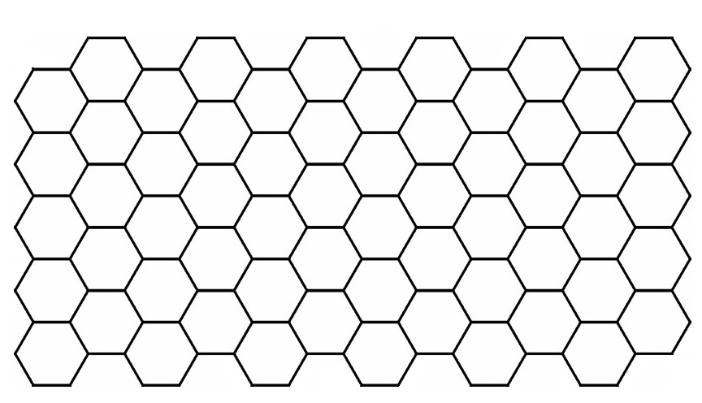
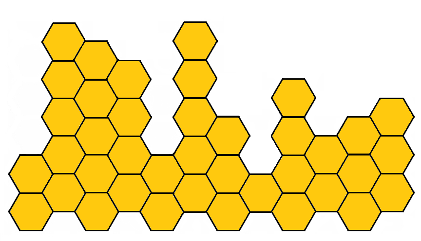
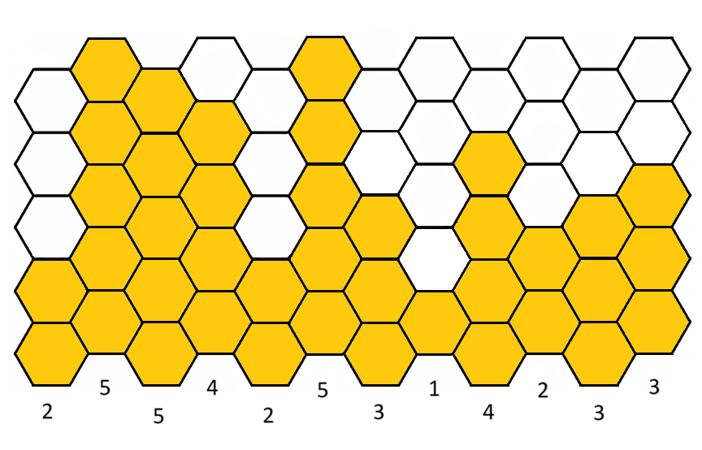
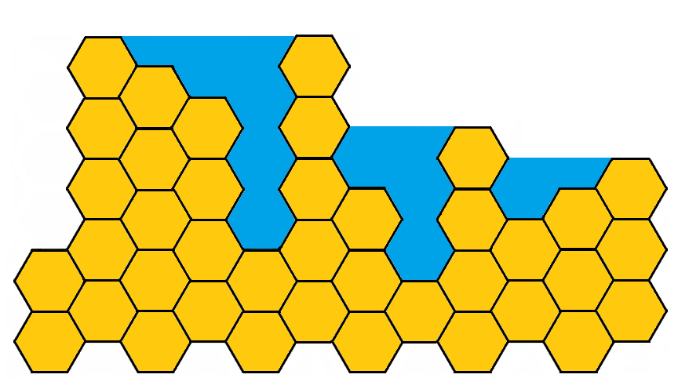
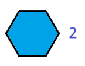
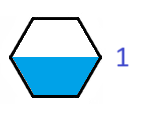

# Summerscript: Rain on the beehive

## Description

A coding exercise for the summer.

## Goal

Calculate the amount of water that will be collected on top of a beehive when it rains.

## Rules

A beehive is a structure composed of regular hexagonal cells oriented with a flat end on top, like this: 

The beehive is built from bottom to top in columns of maximum 5 cells, based on the following 12-column grid:

Example:

A beehive can be represented as a list of 12 integers representing the height of each column from left to right. 

In the previous example, this list would be [2, 5, 5, 4, 2, 5, 3, 1, 4, 2, 3, 3]:

When it rains, water will accumulate on top of the beehive, like this:

Given that cells have an area of 2, and therefore half cells an area of 1: 

 

Calculate the area of the water accumulated on top of a beehive after the rain.

## Calculation example

In the previous example, the result would be 20, because the area of the water is:

8x2 + 4x1 = 16 + 4 = 20